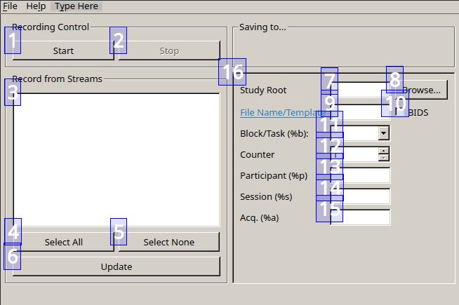

# Working with file name templates

Most sites have specific formats for paths and file names or even switched to
the [BIDS](#BIDS) standard. LabRecorder makes it easier to file and name your
correctly by providing path and file name templates.

All variables (starting with `%`) are replaced with the corresponding field's
contents upon starting the recording.

Supported variables include:
- `%p` participant, `%s` session, `%b` task/block, `%a` acquisition, `%m` modality
- `%n` legacy counter, `%r` BIDS run index
- `%date`, `%time`, `%datetime` (UTC, filename-safe)
- `%hostname` the local machine hostname (sanitized to be filename-safe)

Lets assume your institution requires your file to be saved in
`/mnt/server/studies/your_name/<participant_id>/<session>/<task>.xdf`.

You can let LabRecorder create the files and folders with the following
settings (configuration file keys are `highlighted`):

- `StudyRoot`=`/mnt/server/studies/your_name`
- File Name / Template: `%p/%s/%b.xdf`
- `SessionBlocks`=`"Task 1", "Resting State", "Task 2"`

Before recording, you only need to fill in the fields you're using.
The paths in the File Name Template are created automatically.

The final folder and file path are previewed in the `Saving to...` box (above
`16` in the screenshot).

### Hostname token

Use `%hostname` anywhere in your template to embed the local machine name, e.g.:

`runs/%hostname_%date_%time.xdf`

Hostnames are sanitized for cross-platform filename safety (spaces → `_`, and characters like `<>:"/\|?*` are replaced with `_`).

## BIDS

[BIDS](https://bids.neuroimaging.io/) is a set of conventions for organizing
your research data.
Checking the `BIDS` checkbox (`10` in the screenshot) automatically generates
the correct File Name
Template depending on which variables you set in the fields below.

